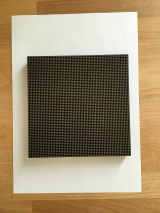
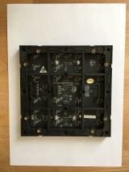
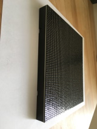
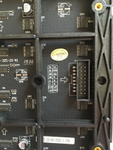
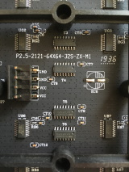

# RGB LED Matrix Panel

- a cheap way to build DMD (dot matrix display) for your pinball machine
- there are different sizes (2-5mm per pixel) and pixel resolutions (up to 64x64) available
- individual panels can be chained together to create even bigger display

## P2.5-2121-64X64-32S-ZX-M1
- sample panel from AliExpress, $15 + $5 shipping (February 2020)
- 64 x 64 pixels, 160mm wide, 160mm high (2.5mm per pixel)
- HUB75 connector
- 5V input voltage
- about 100mA standby current (if you just plug in the matrix and don't display anything)
- 1:32 scan-rate (you can only update 2 rows at once)
- integrated circuits on the board
  - 74HC245TS (transceiver)
  - TC7258GN (line scanning driver chip)
  - ICN2037BP (constant current LED sink driver)

## Driving the LED Matrix

The panel itself contains barely any logic and all the work (timing, mixing colors etc.) has to be done on the device that's driving the display. That makes it surprisingly hard to drive these panels without flickering if you want to use 24-bit colors (8+8+8 bits for red, green and blue). The bandwith that you need for something like that can be in hundreds of megabits per second even for a panel as small as ours (3 chained 64x64 panels for target resolution of 192x64).

Also keep in mind that these panels are using 5V logic while ESP32 or Rasberry Pi are using 3.3V. Some panels have transceivers on input that fix this "issue", but you might need to provide your own.

### ESP32, ESP8266 and Atmel-based Arduinos

[PxMatrix](https://github.com/2dom/PxMatrix)
 - this library is using really smart "trick" to drive the panel via SPI (chaining all the color inputs into one big shift register)
 - it supports wide range of different panel types and sizes
 - quite easy to use although sometimes it's not immediately apparent why is your panel not working as there is basically zero debug information available
 - start with low color depth and go from there, these chips will have problems driving even small panels with full colors (you might hit both memory limits and SPI speed limits)
 
 ### Raspberry Pi
 
 [LED-matrix library](https://github.com/hzeller/rpi-rgb-led-matrix)
  - C++ library for Linux, targets the original hardware of Raspberry Pi
  - stable library with long history, great documentation and [even hardware adapter for your Pi](https://github.com/hzeller/rpi-rgb-led-matrix/tree/master/adapter/active-3)
  - can drive significantly bigger displays than ESP32, newer Raspberry Pi devices can drive up to 3 parallel chains of multiple panels
  - has C# and Python bindings
 
